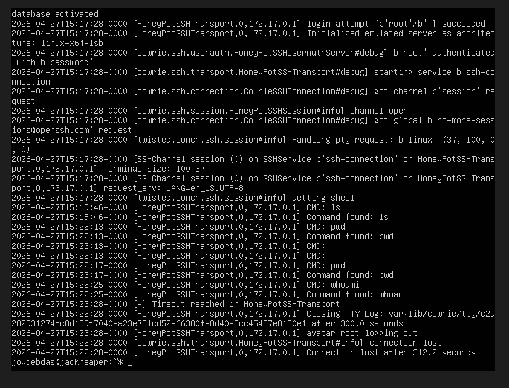

# Cowrie Honeypot Lab

## Overview
Deployed an SSH honeypot using Docker to capture attacker behaviour and commands.

## Setup
- installed Docker
- Ran Cowrie container exposing port 2222

## Test
ssh root@localhost -p 2222

## logs 
sudo docker logs cowrie

## Screenshots
### Cowrie logs

